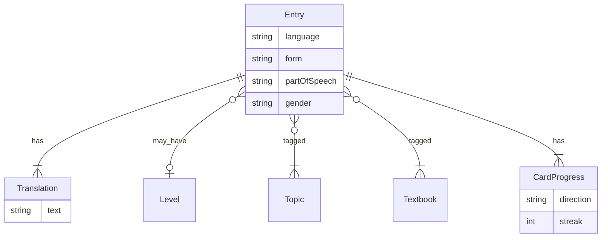

# Модель данных

Словарь и карточки прогресса. Сессии тренировки (время, итог) — I4.

Единица — слово, выражение или фраза на иностранном языке плюс переводы на русский. Карточка = единица × направление.

## Единица (`entry`)

| Поле | Тип | Обязательно | Смысл |
|---|---|---|---|
| `language` | `en` \| `fr` | да | изучаемый язык |
| `form` | строка | да | иностранная форма, как в источнике |
| `partOfSpeech` | см. ниже | да | часть речи для карточки |
| `partOfSpeechCode` | строка | нет | код из учебника: `n`, `adj`, `phr`… |
| `transcription` | строка \| нет | нет | IPA только у иностранной формы, без `/ /` |
| `gender` | `m` \| `f` \| нет | нет | род; для французских существительных |
| `translations` | строки, ≥ 1 | да | переводы на русский |
| `level` | `A1` \| `A2` \| `B1` \| `B2` | нет | один уровень |
| `topics` | строки | нет | метки тем |
| `textbooks` | строки | нет | метки учебников |

Глаголы — в инфинитиве. Форму не нормализуем, кроме обрезки пробелов.

`gender` заполняем из учебника (`ami m` → `m`, `maison f` → `f`). Для английского, глаголов, фраз и прочего — пусто. Пары муж/жен (`ami` / `amie`) — две отдельные единицы. Плюрал (`parents m pl`) — род в `gender`, число пока в `partOfSpeechCode` (`pl n` / как в источнике), отдельного поля числа нет.

`partOfSpeechCode` храним, чтобы не потерять различие «фраза / phrasal verb / plural noun». На карточке показываем `partOfSpeech`.

## Часть речи

Значения `partOfSpeech`: `noun`, `adjective`, `verb`, `pronoun`, `numeral`, `adverb`, `phrase`, `other`.

`phrase` — уточнение к требованиям («слово, выражение или фраза»): для `(phr)` писать «другое» неудобно.

Коды Starlight / похожих вордлистов:

- `n`, `pl n` → `noun`
- `v`, `phr v` → `verb` (`phr v` остаётся в `partOfSpeechCode`)
- `adj` → `adjective`
- `adv` → `adverb`
- `pron` → `pronoun`
- `phr` → `phrase`
- `conj`, `prep`, `pp` и прочее → `other`

## Карточка (`card`)

Карточка = `entry` × направление `foreign_to_native` | `native_to_foreign`.

Прогресс не смешивается с текстом единицы:

| Поле | Смысл |
|---|---|
| `streak` | сколько раз подряд «помню»; нет строки = 0 (новая) |
| вес | `1 / (1 + streak)` — максимум у новых и забытых |

В сессии без повтора пары `(entry_id, direction)`. Набор — взвешенный случайный, до 20 штук (если пул меньше — все).

## Что не в единице

- прогресс и `streak` — по направлению, отдельно;
- сырой скан — рядом в `docs/words/raw/`, в единицу не копируем;
- JSON импорта (следующая волна) — те же поля `entry`.

## Связи

Тема и учебник — справочники меток: одна строка не дублируется зря, единица ссылается на несколько.

## Сырьё → JSON

Скан в `docs/words/raw/`. Извлечение — `docs/words/json/`. Как устроена пачка и что надёжно снять со страницы — [words/README.md](words/README.md).
