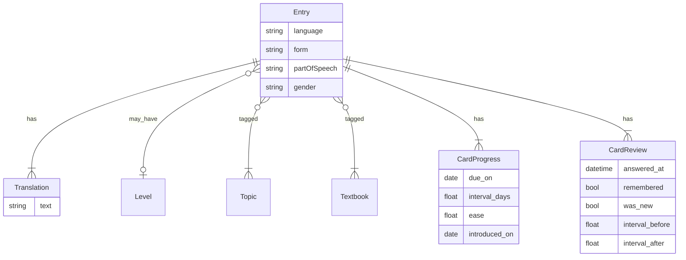

# Модель данных

Словарь, прогресс карточек и лог ответов для сводки.

Единица — слово, выражение или фраза на иностранном языке плюс переводы на русский. Карточка = единица × направление.

## Единица (`entry`)

| Поле | Тип | Обязательно | Смысл |
|---|---|---|---|
| `language` | `en` \| `fr` | да | изучаемый язык |
| `form` | строка | да | иностранная форма, как в источнике |
| `partOfSpeech` | см. ниже | да | часть речи для карточки |
| `partOfSpeechCode` | строка | нет | код из учебника: `n`, `adj`, `phr`… |
| `transcription` | строка \| нет | нет | IPA только у иностранной формы, без `/ /` |
| `gender` | `m` \| `f` \| нет | нет | род; для французских существительных |
| `translations` | строки, ≥ 1 | да | переводы на русский |
| `level` | `A1` \| `A2` \| `B1` \| `B2` | нет | один уровень |
| `topics` | строки | нет | метки тем |
| `textbooks` | строки | нет | метки учебников |

Глаголы — в инфинитиве. Форму не нормализуем, кроме обрезки пробелов.

В БД единица уникальна по `(language, lower(form), part_of_speech)` (индекс `uq_entries_lang_form_pos`). Один и тот же словоформ в двух учебниках — **одна** строка `entries` с несколькими метками в `entry_textbooks`. JSON в `docs/words/json/` остаётся сырьём со страниц и может содержать кросс-книжные повторы; при загрузке (`load_entries.py`) они сливаются (переводы и учебники).

`gender` заполняем из учебника (`ami m` → `m`, `maison f` → `f`). Для английского, глаголов, фраз и прочего — пусто. Пары муж/жен (`ami` / `amie`) — две отдельные единицы. Плюрал (`parents m pl`) — род в `gender`, число пока в `partOfSpeechCode` (`pl n` / как в источнике), отдельного поля числа нет.

`partOfSpeechCode` храним, чтобы не потерять различие «фраза / phrasal verb / plural noun». На карточке показываем `partOfSpeech`.

## Часть речи

Значения `partOfSpeech`: `noun`, `adjective`, `verb`, `pronoun`, `numeral`, `adverb`, `phrase`, `other`.

`phrase` — уточнение к требованиям («слово, выражение или фраза»): для `(phr)` писать «другое» неудобно.

Коды Starlight / похожих вордлистов:

- `n`, `pl n` → `noun`
- `v`, `phr v` → `verb` (`phr v` остаётся в `partOfSpeechCode`)
- `adj` → `adjective`
- `adv` → `adverb`
- `pron` → `pronoun`
- `phr` → `phrase`
- `conj`, `prep`, `pp` и прочее → `other`

## Карточка (`card`)

Карточка = `entry` × направление `foreign_to_native` | `native_to_foreign`.

Прогресс не смешивается с текстом единицы. Нет строки в `card_progress` = новая карточка.

| Поле | Смысл |
|---|---|
| `due_on` | дата следующего показа |
| `interval_days` | текущий интервал (дней) |
| `ease` | множитель (≥ 1.3, старт 2.5) |
| `introduced_on` | день первого показа |
| `introduced_via` | `train` (квота новых) или `assess` (оценка, квоту не жжёт) |

Сессия: все due по фильтру + до N новых в день на язык (EN 10 / FR 20; только `introduced_via = train`). Внутри групп — приоритет направления по языку.

## Ответ (`card_review`)

Одна строка на каждое нажатие в тренировке или оценке. Нужна для перформанса за 7/30 дней (снимок `card_progress` этого не даёт).

| Поле | Смысл |
|---|---|
| `entry_id`, `direction` | какая карточка |
| `answered_at` | когда ответили (timestamp) |
| `answered_on` | календарный день ответа (для 7/30д) |
| `remembered` | помню / не помню (в оценке: знаю|сомневаюсь → true, не знаю → false) |
| `was_new` | до ответа не было строки прогресса |
| `interval_before` | интервал до ответа (0 если новая) |
| `interval_after` | интервал после применения алгоритма |
| `source` | `train` \| `assess` |

Язык для агрегатов брать из `entries`. Учебник в лог не дублируем в первой версии.

## Что не в единице

- прогресс (`due_on`, интервал, ease) — по направлению, отдельно;
- лог ответов (`card_review`) — отдельно от текущего состояния карточки;
- сырой скан — рядом в `docs/words/raw/`, в единицу не копируем;
- JSON импорта (следующая волна) — те же поля `entry`.

## Связи

Тема и учебник — справочники меток: одна строка не дублируется зря, единица ссылается на несколько.

## Сырьё → JSON

Скан в `docs/words/raw/`. Извлечение — `docs/words/json/`. Как устроена пачка и что надёжно снять со страницы — [words/README.md](words/README.md).
